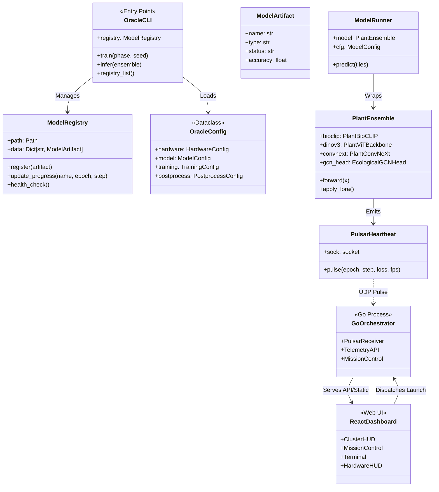
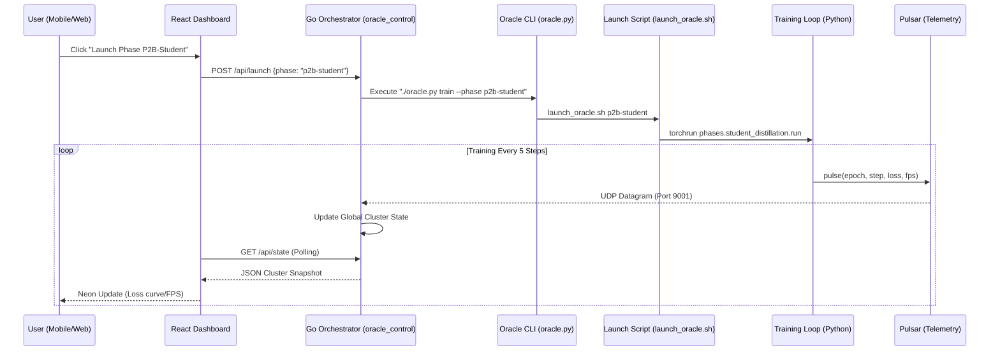

# PlantCLEF 2026: Complete System Architecture

This document provides a comprehensive mapping of all classes in the codebase, organized by their functional layers.

## 1. High-Level Class Diagram (Mermaid)



## 2. Mission Control Sequence Diagram (Mermaid)

This diagram traces the flow from a web-based "Launch" click to a multi-GPU training run.



## 3. Technical Stack Trace (ASCII)

Use this map to navigate the code in the order of execution:

```text
[PHASE 0: CONFIG & REGISTRY]
src/config/schema.py (Dataclass Schema)
src/config/loader.py (Hardware Auto-Detection)
src/config/registry.py (Artifact Persistence)
  └── oracle.py (The Unified Nervous System)

[PHASE 1: DATA PREP]
launch_oracle.sh p1 -> phases/foundation_caching/run.py

[PHASE 2: TRAINING]
launch_oracle.sh <p2a|p2b-student|ad-td> -> phases/head_warmup/run.py | phases/student_distillation/run.py | phases/asymmetric_distillation/run.py
  ├── tools/infrastructure/pulsar.py (Heartbeat)
  └── orchestrator/ (Go Control Plane)

[PHASE 3: INFERENCE]
launch_oracle.sh pipeline -> phases/inference/run.py
  └── phases/inference/pipeline.py (Modular Flow)

[PHASE 4: OBSERVABILITY]
dashboard/ (React + Vite + Tailwind)
  └── orchestrator/telemetry.go (Go Mission Control API)
```

## 3. Core Class Descriptions

| Class | File | Responsibility |
| :--- | :--- | :--- |
| **`PlantEnsemble`** | `src/models/ensemble.py` | The central model. Fuses three backbones and manages LoRA adapters. |
| **`CUDASahiEngine`** | `src/models/sahi.py` | Handles high-resolution tiled inference and result aggregation. |
| **`AsymmetricLoss`** | `src/training/losses.py` | Optimized loss function for the 7,800-class long-tail distribution. |
| **`EcologicalGCNHead`** | `src/models/layers/gcn.py` | Generates classifier weights using an ecological knowledge graph. |
| **`PlantDALIPipeline`** | `src/data/dataloader.py` | GPU-accelerated JPEG decoding and image augmentation. |
| **`GPUEcologicalBuilder`** | `tools/data/build_ecological_db.py` | High-speed bioclimatic niche modeling using VRAM sampling. |
